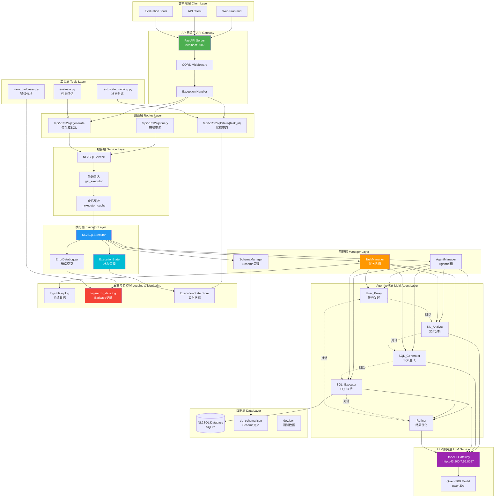

<div align="center"> 

# A2SQL- 多智能体协作下的NL2SQL系统

</div>


## 项目概述

**Agent-to-SQL(a2sql)**是一个基于 AutoGen 框架的智能 NL2SQL Agent 系统, 我们的核心是**理解-生成-执行-反思**。欢迎大家star~⭐⭐。



## 核心功能特性

- **多 Agent 协作**: 基于 AutoGen 框架的多智能体系统
- **自动错误修正**: 智能诊断和修正 SQL 错误
- **灵活配置**: 可自定义 Agent 行为和提示词


### 🏗️ 架构图

```
┌─────────────┐
│ User_Proxy  │  ← 协调者
└──────┬──────┘
       │
   ┌───┴───┐
   │       │
┌──▼───┐ ┌─▼──────┐
│ NL   │ │  SQL   │
│Analyst│ │Generator│
└──┬───┘ └─┬──────┘
   │       │
   └───┬───┘
       │
  ┌────▼─────┐
  │   SQL    │
  │ Executor │
  └────┬─────┘
       │
  ┌────▼─────┐
  │ Refiner  │  ← 错误修正
  └──────────┘
```

## 🚀 快速开始

### 1. 安装依赖

```bash
pip install -r requirements.txt
```

### 2. 配置环境变量

复制 `.env.example` 为 `.env`,填写配置:

```bash
OPENAI_API_KEY=your-api-key-here
MODEL_NAME=gpt-4
DEFAULT_SCHEMA_FILE=data/CSpider/db_schema.json
```

### 3. 使用方式

#### 方式一: CLI 命令行

```bash
python main.py \
  --db-id college_2 \
  --query "查询所有在 Computer Science 部门工作的教师"
```

#### 方式二: FastAPI 服务

启动 API 服务:
```bash
cd api
python main.py
```

访问文档: http://localhost:8000/docs

调用 API:
```bash
curl -X POST "http://localhost:8000/nl2sql" \
  -H "Content-Type: application/json" \
  -d '{
    "db_id": "college_2",
    "nl_query": "查询所有教师的姓名和工资"
  }'
```

#### 方式三: Python 代码

```python
from a2sql.executors import NL2SQLExecutor
from a2sql.utils import Config

# 加载配置
config = Config()

# 创建执行器
executor = NL2SQLExecutor(
    schema_file="data/CSpider/db_schema.json",
    llm_config=config.get_llm_config()
)

# 执行查询
result = executor.execute(
    db_id="college_2",
    nl_query="查询所有教师"
)

if result.is_success():
    print(f"成功: {result.data}")
else:
    print(f"失败: {result.error}")
```

## 📡 API 接口

### 端点列表

| 端点 | 方法 | 说明 |
|------|------|------|
| `/` | GET | 根端点 |
| `/health` | GET | 健康检查 |
| `/databases` | GET | 获取数据库列表 |
| `/databases/{db_id}` | GET | 获取数据库信息 |
| `/nl2sql` | POST | 执行 NL2SQL 转换 |
| `/config` | GET | 获取配置信息 |

### 请求示例

```json
{
  "db_id": "college_2",
  "nl_query": "统计每个部门的教师数量",
  "max_round": 20
}
```

### 响应示例

```json
{
  "status": "success",
  "data": {
    "result": "任务完成"
  },
  "metadata": {
    "db_id": "college_2",
    "nl_query": "统计每个部门的教师数量"
  }
}
```

## 🧪 测试

### 运行测试

```bash
# 测试管理器
python -m pytest tests/test_managers.py

# 测试执行器
python -m pytest tests/test_executors.py

# 运行所有测试
python -m pytest tests/
```

### 测试覆盖

- ✅ SchemaManager 初始化和功能测试
- ✅ AgentManager Agent 创建测试
- ✅ NL2SQLExecutor 执行流程测试
- ✅ 配置验证测试

## 🔍 设计模式

### 1. 策略模式
每个 Agent 实现不同的策略 (NL 分析、SQL 生成、执行、修正)

### 2. 工厂模式
AgentManager 作为 Agent 工厂,统一创建和管理

### 3. 单一职责原则
- Core: 定义抽象接口
- Agents: 实现具体 Agent 逻辑
- Managers: 管理资源和生命周期
- Executors: 编排执行流程
- Utils: 提供工具支持

### 4. 依赖注入
通过构造函数注入配置和依赖

## 🔐 最佳实践

### 安全性
- 环境变量管理敏感信息
- API Key 不硬编码
- 日志不输出敏感数据

### 可维护性
- 代码分层清晰
- 接口定义明确
- 文档注释完整
- 单元测试覆盖

### 可扩展性
- 基类继承机制
- 插件式 Agent 设计
- 配置化管理

---

## NL2SQL技术路线

### 1. 提示词

建表信息 + 用户问题 + 简单提示词。通常参数量超过 7B 的大语言模型能够生成简单问题对应的 SQL 语句。但是这种基本表示方法缺点同样明显,例如没有任务描述,仅以 "SELECT" 开头,对输入文本没有压缩、过滤、数据增强,大语言模型不一定能够完成补全。

这个技术路线如果上微调的话,可以考虑输入压缩 + COT范式

### 2. in-context learning