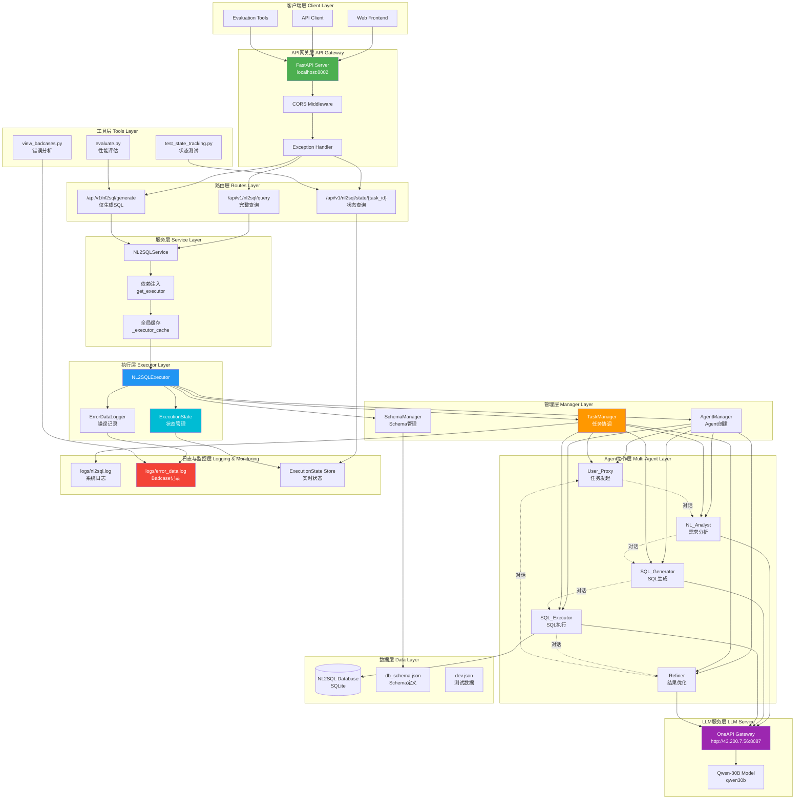

<div align="center"> 

# A2SQL- 多智能体协作下的NL2SQL系统

</div>


## 项目概述

**Agent-to-SQL(a2sql)** 是一个基于AutoGen框架开发的NL2SQL-Agent 系统, 旨在为企业提供稳定、精准、可无缝集成到业务流程中的智能数据查询能力。A2SQL的核心架构围绕 **理解-生成-执行-反思** 四个关键步骤构建，确保在复杂查询场景下依旧保持高精度与强鲁棒性。欢迎大家star~⭐⭐。

## TODO

1. SQL生成准确率达95%以上

2. 纯SQL生成响应时间<1s

3. 对于多表结构上下文溢出的处理

4. 对数据库意图识别的处理
5. 埋点收集badcase与训练代码(dpo-badcase处理 / 蒸馏-模型迁移处理)集成至接口
6. MYSQL数据库一键导入a2sql接口，并考虑数据一致性与安全问题
7. 如何快速接入已有的项目？


---

### 架构图

```
# sql2qa
┌─────────────┐
│ User_Proxy  │  ← 协调者
└──────┬──────┘
       │
   ┌───┴───┐
   │       │
┌──▼───┐ ┌─▼──────┐
│ NL   │ │  SQL   │
│Analyst│ │Generator│       
└──┬───┘ └─┬──────┘
   │       │
   └───┬───┘
       │
  ┌────▼─────┐
  │   SQL    │
  │ Executor │
  └────┬─────┘
       │
  ┌────▼─────┐
  │ Refiner  │  ← 错误修正
  └──────────┘
```

---


# 致谢

先谢谢我自己哈哈哈哈哈